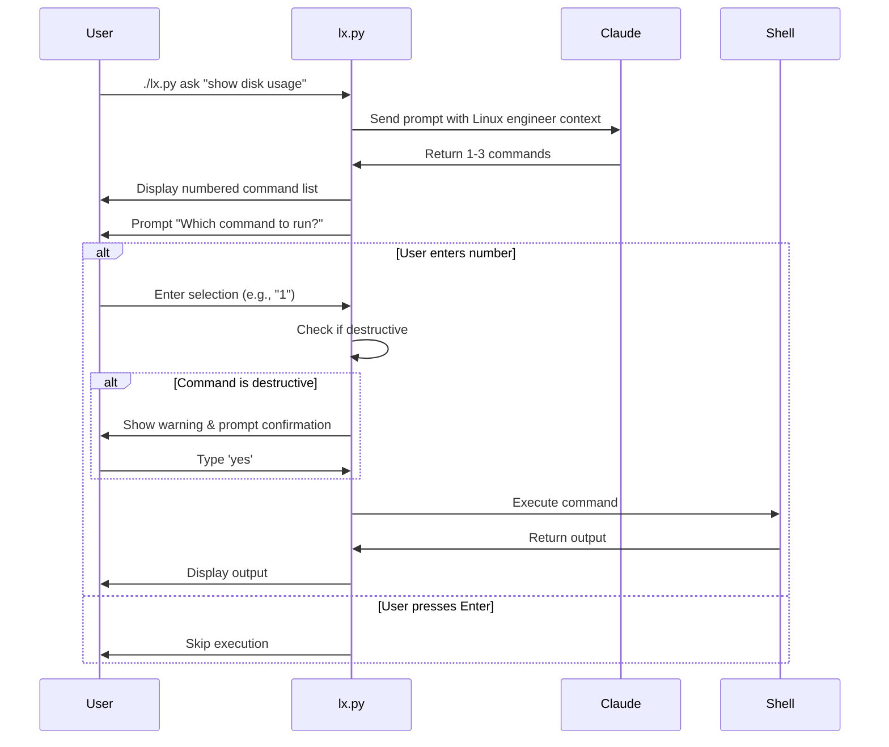

# Personal productivity scripts

## Quickstart

Requires Python >= 3.12 and [uv](https://docs.astral.sh/uv/). Scripts are executable directly:

```bash
./aca.py --help
./lx.py ask "show disk usage"
./gitlab-mr-comments.py --help
./find-related-commits.py --help
./git-switch-main.py
./git-undo --help
```

## Tools

### aca.py — AI Commit Assistant

Generate commit messages and GitLab MR descriptions using Claude.

- `commit` — generate a commit message from staged changes
- `mr-desc` — generate MR title/description from branch commits, create draft MR via `glab`
- `doctor` — check dependencies and authentication

```bash
./aca.py commit
./aca.py mr-desc
```

Requires: [Claude Code CLI](https://claude.ai/download), `glab` (for `mr-desc`)

### lx.py — Linux Command Assistant

Get Linux command suggestions from Claude and execute them interactively.

**Key Features:**
- Claude-powered Linux engineer assistant (uses Sonnet by default)
- Returns 1-3 focused commands per query
- Interactive command selection and execution
- Destructive command detection with confirmation prompts

```bash
./lx.py ask "show disk usage"
./lx.py ask "list all running processes sorted by memory"
./lx.py -v ask "configure firewall to allow port 8080"
./lx.py doctor  # run diagnostic checks
```

**Example Output:**

```
❯ ./lx.py ask "check apache configuration"
Consulting Linux engineer...
1. apachectl configtest
2. apache2ctl -t
3. httpd -t
Which command to run? (number or Enter to skip):
```

**Workflow:**



**Requirements:** [Claude Code CLI](https://claude.ai/download)

**Configuration:** Shares configuration with aca.py via `~/.config/aca/config.toml`. Model can be changed via `default_model` key or `ACA_DEFAULT_MODEL` env var.

> **Safety Notice**: The tool detects potentially destructive commands (rm, dd, mkfs, chmod, systemctl stop, etc.) and prompts for explicit confirmation before execution.

### find_related_commits.py

Find commits in a range that touched currently staged files, then optionally fixup + rebase.

```bash
git add <files>
./find-related-commits.py HEAD~10
```

### gitlab-mr-comments.py

Fetch unresolved MR discussion threads with code context (for LLM consumption).

```bash
export GITLAB_TOKEN=<token>
./gitlab-mr-comments.py --mr-url https://gitlab.com/group/project/-/merge_requests/123
```

### git-undo

Undo git commits with soft or hard reset, with safety checks to prevent data loss.

```bash
./git-undo           # soft reset last commit, keep changes staged
./git-undo 3         # soft reset last 3 commits
./git-undo --soft 2  # soft reset, unstage changes
./git-undo --hard 1  # hard reset, discard changes - prompts for confirmation
```

Note: Prevents hard reset of all commits to avoid repository corruption.

### git-switch-main.py

Intelligently switch to the main/default branch (stage/main/master) with automatic stashing.

**Features:**
- Auto-detects main branch via origin/HEAD or common names
- Caches detected branch in git config (`branch-switch.name`)
- Automatically stashes uncommitted changes (including untracked files)
- Restores stash after successful branch switch
- Creates local tracking branch if needed

```bash
./git-switch-main.py
```

Manual override: `git config branch-switch.name <branch>`

Requires: Python >= 3.12, uv, GitPython, Rich

## Skipping Pre-commit Hooks

The `aca.py commit` command runs pre-commit hooks on staged files before committing. This ensures code passes validation before the commit is created.

To bypass pre-commit hooks temporarily, set the `SKIP_PRECOMMIT` environment variable:

```bash
SKIP_PRECOMMIT=1 ./aca.py commit
```

**Behavior:** When `SKIP_PRECOMMIT` is set, hooks are completely bypassed:
- Pre-commit validation phase is skipped (before generating the commit message)
- The `--no-verify` flag is added to `git commit` to skip hooks during the commit phase

This ensures consistent hook-skipping behavior across both validation phases, preventing the scenario where hooks are skipped during validation but still run during commit.

**Use cases:**
- CI environments where hooks are run separately
- Emergency fixes when hooks are temporarily broken
- When hooks are known to pass but you want to skip re-running them

**Warning:** Use sparingly to maintain code quality. Pre-commit hooks help catch issues early.
